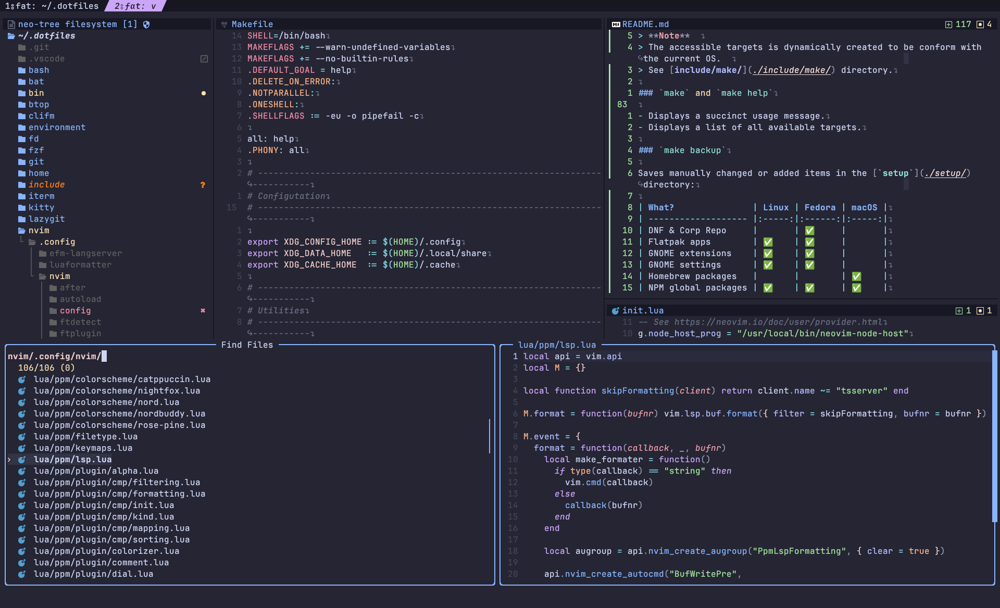

<h3 align="center">
 <br/>
<a href="https://github.com/piouPiouM">Mehdi Kabab</a>'s dotfiles
</h3>
<p align="center">
  
  
  
</p>
Manage backup, restore, and installation of my environments [since 2011](https://github.com/piouPiouM/dotfiles/commit/ec918b4). Based on the [XDG Base Directory Specification](https://specifications.freedesktop.org/basedir-spec/basedir-spec-latest.html) and uses [GNU Stow](https://www.gnu.org/software/stow/) to maintain symlinks to my home directory. Mainly to reduce the mess in my `$HOME` 🍺


<p align="center"><em>Preview of my Neovim interface</em></p>

## Contents

As Front-end developer, I am using CLI in my day-to-day workflow. The tools I use most frequently have their configuration versioned in this repository:

- [Kitty](https://sw.kovidgoyal.net/kitty/) as terminal emulator.
- Zsh as main shell with [zim](https://zimfw.sh/) to manage shell plugins and [Starship](https://starship.rs/) prompt.
- [Neovim](https://neovim.io/) as main editor and visual editor.
- [fzf](https://github.com/junegunn/fzf) as command-line fuzzy finder 🌸
- [ripgrep](https://github.com/BurntSushi/ripgrep) as search and replace tool.
- [fd](https://github.com/sharkdp/fd) as fast and user-friendly alternative to find.
- [Lazygit](https://github.com/jesseduffield/lazygit) as git Terminal UI (_TUI_).

### Linux

I using Fedora with Wayland, switch between GNOME Desktop Environment and Sway compositor.

- DNF and Flatpak as packages manager.

### macOS

I also use macOS in my daily life.

- Homebrew as packages manager.

---
## Installation

> **Warning**  
> This repository covers my personal needs. I do not recommend that you run the setup or installation tasks without reviewing the code and understanding its impact. Use at your own risk!

You can start by cloning the repository.

```sh
$ git clone --depth 1 https://github.com/piouPiouM/dotfiles.git ~/.dotfiles
$ cd ~/.dotfiles
```

> **Note**
> I use `~/.dotfiles` as the destination directory because an alias allows me to directly edit the folder from any location: [`dotfiles`](https://github.com/piouPiouM/dotfiles/blob/ddc85554b0d2e5c9e6a386800612130c2d246e4d/zsh/.config/zsh/plugins/aliases/init.zsh#L16).
### Installation à la carte

The best option for controlling your environment: install only what you need. However, 3 tasks will be required to ensure that the other automated tasks run smoothly:

```sh
$ make install-dirs install-stow install-links
```

Now you can browse the available tasks using the `make help` command. 
### Fresh operating system installation?

These instructions are for setting up new macOS or Fedora operating system.

```sh
$ make setup
```

> **Warning**  
> It's a WIP target knowing that I'm adding cross-platform support and that I don't reinstall my OS every day 😂

### Install without alter the system?

```sh
$ make install
```

## Local override

I use my dotfiles for personal and professional purposes, on distinct devices. Some information such as my git email address or business scripts, are stored specifically on each machine. To help me, some non-versioned configuration files can be loaded:

- Shell environment: `~/.local/share/zsh/exports.zsh`.
- Git: `~/.local/share/git/config` (copy [local-config.sample](https://github.com/piouPiouM/dotfiles/blob/ddc85554b0d2e5c9e6a386800612130c2d246e4d/git/.local/share/git/local-config.sample)).

| App             | Config file                                              |
| --------------- | -------------------------------------------------------- |
| Zsh environment | `~/.local/share/zsh/exports.zsh`                           |
| Git             | `~/.local/share/git/config` (see [local-config.sample][1]) |

[1]: https://github.com/piouPiouM/dotfiles/blob/ddc85554b0d2e5c9e6a386800612130c2d246e4d/git/.local/share/git/local-config.sample

---

## Automated tasks

I heavily use [Make](https://www.gnu.org/software/make/) to automatize my maintenance tasks.  
_Why Make?_ Because it's commonly shipped with \*nix OS. I can directly launch the setup process without installing anything else.

> **Note**  
> The accessible targets are dynamically created to be conform with the current OS.  See [include/make/](./include/make/) directory.

### Display available tasks

```sh
$ make help
```

<details>
  <summary>Output of <code>make help</code></summary>
  <pre>Targets:
  backup                           Backup all settings.
  backup-dnf-copr                  Backup list of enabled Copr repo (see setup-dnf-copr).
  backup-flatpak                   Backup list of installed Flatpak applications (see install-packages-flatpak).
  backup-gnome-extensions          Backup list of installed GNOME Shell Extensions (see install-gnome-extensions).
  backup-gnome-settings            Backup GNOME user settings.
  backup-npm                       Backup list of global npm packages.
  cleanup                          Clean all cache systems.
  help                             Print usage and this help message.
  install                          Install all the prerequisites.
  install-browser                  Install Web browsers.
  install-fonts                    Download and install fonts.
  install-fonts-codicon            Download and install Codicon font.
  install-fonts-ibm-plex           Download and install IBM Plex.
  install-fonts-nerd               Download and install Nerd Fonts.
  install-fonts-nerd-symbols-only  Download and install Nerd Fonts Symbols only.
  install-fzf                      Install fzf (Fuzzy finder) from sources.
  install-gnome-extensions         Install or update GNOME Shell Extensions.
  install-neovim                   Install or update Neovim.
  install-neovim-dependencies      Install or update Neovim dependencies.
  install-neovim-plugins           Install or reinstall Neovim plugins.
  install-obsidian                 Install or update Obsidian.
  install-packages-cli             Install CLI packages.
  install-packages-flatpak         Install Flatpak applications.
  install-packages-gui             Install GUI packages.
  install-starship                 Install Starship shell prompt.
  install-sway                     Install Sway window manager.
  install-themes                   Install themes for various tools.
  link-bin                         Link personnal binaries.
  link-home                        Generates only symlinks for the $HOME directory.
  restore-gnome-settings           Restore GNOME user settings.
  restore-npm                      Install globaly npm packages.
  setup-battery-management         Setup battery management.
  setup                            Perform setup of the device.
  setup-dirs                       Creates the dotfiles tree structure.
  setup-dnf                        Setup DNF configuration and repositories.
  setup-hostname                   Setup hostname.
  setup-links                      Generates all the symlinks.
  setup-neovim                     Setup Neovim environment.
  setup-npm                        Setup npm environment.
  setup-packages                   Install all packages.
  setup-sync                       Setup synchronization tools.
  setup-terminal                   Setup terminal application.
  theme-catppuccin                 Download Catppuccin theme.
  theme-nightfox                   Download Nightfox theme.
  theme-rose-pine                  Download Rosé Pine theme.
  uninstall-fzf                    Uninstall fzf (Fuzzy finder).
  unlink-all                       Deletes all the symlinks.
  unlink-bin                       Delete symlink of custom binaries.
  unlink-home                      Deletes symlinks in the Home directory.
  update-packages-npm              Update globaly all npm packages.
  update-starship                  Update Starship shell prompt.
  versions                         Print the version number of main programs.
  
Symlink targets:
  [un]link-bash
  [un]link-bat
  [un]link-btop
  [un]link-clifm
  [un]link-environment
  [un]link-fd
  [un]link-fzf
  [un]link-git
  [un]link-kitty
  [un]link-lazygit
  [un]link-nvim
  [un]link-ranger
  [un]link-ripgrep
  [un]link-rofi
  [un]link-sway
  [un]link-tmux
  [un]link-zsh</pre>
</details>

### Backup settings

```sh
$ make backup
```

Saves manually changed or added items in the [`setup`](./setup/) directory:

| What?               | Linux | Fedora | macOS |
| ------------------- |:-----:|:------:|:-----:|
| DNF & Corp Repo     |       |   ✅   |       |
| Flatpak apps        |  ✅   |   ✅   |       |
| GNOME extensions    |  ✅   |   ✅   |       |
| GNOME settings      |  ✅   |   ✅   |       |
| Homebrew packages   |       |        |  ✅   |
| NPM global packages |  ✅   |   ✅   |  ✅   |

### Neovim

My Neovim configuration is the one that evolves most frequently. The plugins I use are no exception, as the Neovim ecosystem is so rich and constantly evolving.  I use [many plugins](https://github.com/piouPiouM/dotfiles/blob/master/nvim/.config/nvim/lua/ppm/plugin/init.lua)  like:

- [packer.nvim](https://github.com/wbthomason/packer.nvim) for manage my plugins
- [nvim-treesitter](https://github.com/nvim-treesitter/nvim-treesitter)  as langage parser
- [nvim-lspconfig](https://github.com/neovim/nvim-lspconfig) as LSP configuration helper
- [lspsaga.nvim](https://github.com/nvimdev/lspsaga.nvim) for improve Neovim LSP experience
- [fzf-lua](https://github.com/ibhagwan/fzf-lua) as powerful fuzzy finder 🌸
- [nvim-cmp](https://github.com/hrsh7th/nvim-cmp) as completion engine
- [lualine.nvim](https://github.com/nvim-lualine/lualine.nvim) for customize the status bar, tabs and winbar
- [leap.nvim](https://github.com/ggandor/leap.nvim) as motion helper 🦘
- [gitsigns.nvim](https://github.com/lewis6991/gitsigns.nvim) to integrate Git into Neovim

```sh
$ make setup-neovim
```

The task will install Neovim Nightly (which follows the HEAD of the git master branch) with the needed dependencies and providers. 
### Fonts

```sh
$ make install-fonts
```

Launch installation of used font-faces, mainly:

- [JetBrains Mono](https://www.jetbrains.com/lp/mono/) as monospace font.
- [IBM Plex](https://www.ibm.com/plex/) for Obsidian.
- [Nerds Font](https://www.nerdfonts.com/) to enhance my TUI.

> **Note**  
> Symbols of Nerd Fonts are installed by the [`install-fonts-nerd-symbols-only`](https://github.com/piouPiouM/dotfiles/blob/ddc85554b0d2e5c9e6a386800612130c2d246e4d/include/make/target-fonts.mk#L43-L54) target, which also updates the list of symbols in [Kitty's configuration](./kitty/.config/kitty/nerd-fonts.conf) in order to always be up to date 🪄

### Themes

After years of using the [Iceberg](https://cocopon.github.io/iceberg.vim/) theme for Vim and Neovim, I've decided to opt for these 3 themes, which also offer satisfactory light variations: [Catppuccin](https://catppuccin.com/), [Rosé Pine](https://rosepinetheme.com/) and [NightFox](https://github.com/EdenEast/nightfox.nvim).

```sh
$ make install-themes
```

Where available, themes for these tools are also downloaded:

| App          | Catppuccin | Rosé Pine | NightFox |
| ------------ |:----------:|:---------:|:--------:|
| bat          |     ✅     |    ✅     |          |
| btop         |     ✅     |           |          |
| fzf          |     ✅     |    ✅     |          |
| kitty        |     ✅     |    ✅     |    ✅    |
| lazygit      |     ✅     |           |          |
| neovim       |     ✅     |    ✅     |    ✅    |
| rofi (linux) |     ✅     |    ✅     |          |

Each theme can be individually installed or updated with the tasks `theme-catppuccin`, `theme-rose-pine` or `theme-nightfox`.

Each tool requires its own method for using a theme. This is automated with the `colorscheme dark|light|soft-dark|soft-light` shell command. The preference is saved in the `~/.theme` file ([home/dot-theme](./home/dot-theme)).

```sh
$  colorscheme light
⍻ Theme applied for Kitty
⍻ Theme applied for Bat
⍻ Theme applied for btop
⍻ Theme applied for fzf
⍻ Theme applied for Lazygit
```

> **Note**  
> Neovim does not yet benefit from this automation.

---

## FAQ
### How do I force a task to run?

The way Make works means that some tasks will have no effect because the files downloaded or created already exist on disk. Use the `-B` flag to force execution of the task:

```sh
$ make theme-rose-pine # Do nothing

$ make -B theme-rose-pine # Force
• Download rose-pine.sh for fzf
• Download rose-pine-dawn.sh for fzf
• Download rose-pine-moon.sh for fzf
• Download rose-pine.rasi theme for Rofi
• Download rose-pine-dawn.rasi theme for Rofi
• Download rose-pine-moon.rasi theme for Rofi
```
### Error `zsh compinit: insecure directories, run compaudit for list`

This error may occur when opening a new shell. The following command will certainly solve the problem:

```sh
$ compaudit | xargs chmod g-w
```

### Error `trash: error -1701`

If you get this error when using Kitty, you need to reset the Finder access permissions using the following command. A
confirmation prompt will be displayed the next time you run the `trash` command.

```sh
$ tccutil reset AppleEvents net.kovidgoyal.kitty
```

Thx to [@gsbabil](https://github.com/ali-rantakari/trash/issues/37#issuecomment-1104788438) for the tip!